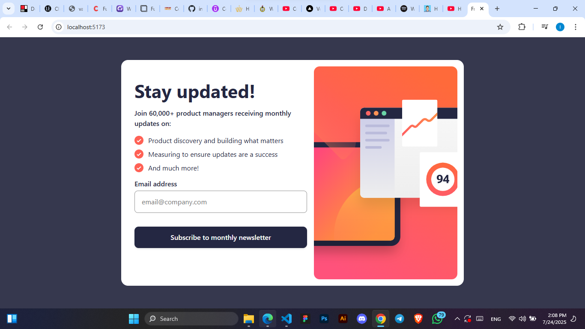

# Frontend Mentor - Newsletter sign-up form with success message solution

This is a solution to the [Newsletter sign-up form with success message challenge on Frontend Mentor](https://www.frontendmentor.io/challenges/newsletter-signup-form-with-success-message-3FC1AZbNrv). Frontend Mentor challenges help you improve your coding skills by building realistic projects. 

## Table of contents

- [Overview](#overview)
  - [The challenge](#the-challenge)
  - [Screenshot](#screenshot)
  - [Links](#links)
- [My process](#my-process)
  - [Built with](#built-with)
  - [What I learned](#what-i-learned)
- [Author](#author)

## Overview
This is a newsletter sign up form that accepts user email and shows a success message when the correct email format is entered. It was built using react and vite.

### The challenge

Users should be able to:

- Add their email and submit the form
- See a success message with their email after successfully submitting the form
- See form validation messages if:
  - The field is left empty
  - The email address is not formatted correctly
- View the optimal layout for the interface depending on their device's screen size
- See hover and focus states for all interactive elements on the page

### Screenshot

### Links

- Solution URL: [Add solution URL here](https://your-solution-url.com)
- Live Site URL: [Add live site URL here](https://your-live-site-url.com)

## My process
Firstly, I go through the designs and determine what decisions I should make in development. I write these decisions down in a note from simplest to most difficult. An example will be whether to use CSS grids or flexbox or validate using regex for email validation or the in-built HTML form validation, getting a clear view of these decision help to make work easier and faster.
Secondly, I use React JS becuase it is Javascript most common framework which gives me access to a lot of information in case any anything goes wrongly.
Thirdly, I write most of the required JSX and CSS and include each feature from easiest to most difficult. 

### Built with

- React JS
- Vite
- CSS flexbox
- CSS Grid
- Mobile-first workflow
- [React](https://reactjs.org/) - JS library

### What I learned

This section helped me understand how to connect different pages in a React appliaction using the react router dom and I
also got more understanding on how to validate emails using regex.

## Author

- Frontend Mentor - [@iynlwa](https://www.frontendmentor.io/profile/iynulwa)
- Twitter - [@iynulwa](https://www.twitter.com/iynulwa)
